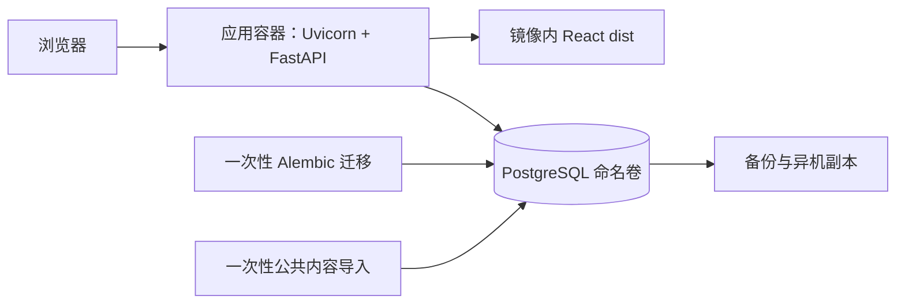

# 容器化部署规划

> 版本：v1.1 ｜ 日期：2026-10-05
> **本机容器化已实现；不引入新依赖。** 本文保留完整生产规划；实际运行配置、操作与验证证据见 [容器化本机验证](容器化本机验证.md)。未实现的生产事项不能视为已交付。
> 原始规划基线：master `caa0fe777af898bab7a2aa54d47e157941b55dae`（T3/T4 已合入）。选型见 [ADR-005](../adr/ADR-005-单机容器化部署.md)，执行拆分见 [T6](../tasks/t6-容器化部署.md)。

## 当前实施状态

PR #7 统一保留规划和本机实现，代码基于 master `c160d9f`。Dockerfile 使用 Node 24 构建、Python 3.12 运行；Compose 包含 app/db、一次性 migrate 和显式 demo，默认仅开放 `127.0.0.1:18080`。无 Caddy/Nginx，也未修改 npm/pip 依赖清单。

| 范围 | 当前状态 |
|---|---|
| 应用适配 B1–B4、B7 | 已实现生产禁止自动建表/旧 seed、配置校验、文件秘密读取、数据库/迁移就绪检查、静态深链接 |
| URL 与数据库验证 B5–B6 | 已处理 Alembic 百分号插值；已完成 PostgreSQL 实测，特殊字符真实密码的完整矩阵待验证 |
| 内容导入 B8–B10 | 当前仅显式导入虚构示例；通用公共内容包、更新与隐私审核工具未实现 |
| 镜像与持久化 | 已实现多阶段构建、非 root、只读根目录、隔离卷与日志轮换；精确摘要发布和传递依赖锁定待完善 |
| 恢复与上线 | 已验证重建持久化、数据库故障和一次隔离恢复；角色分权、自动异机备份、HTTPS、容量与升级回退待完成 |

下文描述生产目标与验收要求，不能直接当作当前 Compose 已具备的能力。当前操作以本机验证文档为准。

## 1. 目标与约束

在单台 Linux 主机用 Docker Compose 运行现有项目，形成可重复发布、数据持久化、备份恢复和版本回退的流程。部署地点尚未确定，用户已选择按小规模自用规划。

**只打包和适配已有技术栈**：React/Vite、FastAPI/Uvicorn、SQLAlchemy/Alembic、PostgreSQL。Docker/Compose 是本次容器化的运行环境；不新增 npm/pip 包，不新增 Caddy、Nginx、Gunicorn、WhiteNoise、Redis、证书客户端或其他常驻服务。所需文件读取、探针和辅助逻辑用标准库及既有依赖实现。容量不足时先报告边界，不自动增加组件。

| 项目 | 规划基线 | 实施前需确定 |
|---|---|---|
| 主机 | 单台 Linux，优先 linux/amd64 | 发行版、架构、磁盘；ARM/NAS 另验镜像兼容性 |
| 资源 | 2 vCPU、4 GiB 内存、40 GiB 可用磁盘作为验证起点 | 属于容量假设，非实测保证；构建尽量在开发机/CI 完成 |
| 运行环境 | Docker Engine + Compose v2 | 实际版本及健康依赖、secrets 等所需能力 |
| 访问 | 默认仅主机回环，SSH 隧道验证 | 内网/VPN/公网模式、绑定地址、既有 TLS 条件 |
| 可用性 | 接受单机故障、维护窗口和短时停机 | 不承诺零停机，正式部署前明确维护时间 |
| 数据目标 | RPO ≤ 24 小时，RTO ≤ 4 小时 | 即最多丢失 24 小时数据、4 小时内恢复；须演练验证 |
| 镜像 | 一个应用镜像 + 官方 PostgreSQL 镜像 | 仓库、拉取权限、精确版本和摘要 |
| 备份 | 每日一次，异机加密副本 | 复用既有存储/调度能力，明确目的地、密钥与责任人 |

镜像仓库、域名、证书和主机都未创建或购买。本轮已在本机用虚构数据完成构建、启动和迁移；未执行公网部署。

## 2. 原始代码基线与生产部署前置项

React 登录、画像、出行、清单及旧记录迁移已随 PR #5 合入；`site/` 已退役，数据在 `data/`，导出工具为 `tools/dump-data.js`。现有验收记录见 [前端验收](前端验收.md)，它不是容器部署的验证报告。

| ID | 代码事实 | 未来适配 / 验收要求 |
|---|---|---|
| B1 | `backend/app/main.py` lifespan 与 `seed.py` 都调用 `Base.metadata.create_all` | 生产只能由 Alembic 改表；应用和导入作业不建表。不能先自动建表再假定迁移已完成。 |
| B2 | seed 不论 profile 是否存在都创建固定默认账号/密码，并生成默认出行 | 生产不直接运行旧 seed；公共导入不创建任何账号，私人迁移显式指定用户。 |
| B3 | `/api/health` 返回固定状态 | 保留为存活探针；新增 `/api/ready` 查询数据库和迁移版本，失败返回 503，无连接信息泄漏。 |
| B4 | Settings 有开发数据库和示例 JWT 默认值，无 `_FILE` 支持 | 加生产校验，用标准库读 secret 文件；缺失/示例密钥失败；不默默落到 SQLite。 |
| B5 | Alembic 的 `config.set_main_option` 接收数据库 URL | 正确处理密码 URL 编码及 `%` 插值；测试含特殊字符的实际连接与迁移。 |
| B6 | 现有后端快测与浏览器测试后端均用 SQLite | 复用 pytest/Playwright 增加 PostgreSQL 迁移、约束及生产入口验证，不增加测试框架。 |
| B7 | FastAPI 目前没有静态托管；Vite 代理仅用于开发 | 复用 StaticFiles/FileResponse 托管 dist，适配 SPA 深链接，同时保留 API 404/401 与其他状态。 |
| B8 | seed 调用 Node，按仓库布局读取 `data/`，另读 `config/profile.json` | 拆成独立 JSON 包导出/校验/导入，运行应用不依赖 Node 和仓库全量目录。现有 dump 已不导出 PROFILE，继续保持。 |
| B9 | seed 跳过已有 plan/network；route 仅随新增 plan 导入 | 明确新增/更新与重复执行语义；旧 seed 不能当完整内容更新工具。 |
| B10 | 流水线从家庭起点生成路线，Route 按 plan 共享 | 检查完整地址/地标/轨迹，只导入可共享内容；不能把一个家庭的起点共享给全部账号。 |

`/api/plans`、`/api/network` 当前要求登录；「公共方案」指用户间共享，不是匿名开放。旧记录迁移现已实现；同源浏览器记录可自动导入，不同 origin/file:// 仍需从原浏览器导出后在画像页导入。

## 3. 目标拓扑和静态文件托管

| 服务/作业 | 生命周期 | 端口/持久化 |
|---|---|---|
| `app` | 唯一常驻应用服务；前端产物 + FastAPI/Uvicorn | 容器 8000；默认映射主机 `127.0.0.1:18080`；代码与 dist 只读，用户数据入库 |
| `db` | 常驻 PostgreSQL | 内部 5432，不发布主机端口；`pgdata` 命名卷 |
| `migrate` | 与 app 同一镜像摘要的一次性作业 | 使用迁移角色执行 Alembic，成功后退出，不循环重启 |
| `content-import` | 与 app 同版本的一次性作业 | 只读挂载受控 JSON 包，不含 profile 或默认账号 |
| 私人数据迁移/备份 | 明确触发的运维作业 | 最小数据库/文件权限；输出不在前端目录中 |

app 接入口网络和内部数据库网络；db 只接数据库网络，迁移/导入按需加入。数据库及管理凭据不暴露到客户端。地图展示读取已导入的数据，运行服务无须调用高德；生成路线继续在工具环境执行。

### 3.1 FastAPI 托管规则

使用当前 FastAPI 已提供的 `fastapi.staticfiles.StaticFiles` 和 `fastapi.responses.FileResponse`，无需新包。只依赖现有版本能力，不调用新版本才有的 `app.frontend()`。[FastAPI 静态文件说明](https://fastapi.tiangolo.com/tutorial/static-files/)。

- 后端 API 先注册，`/api` 与 `/api/*` 保持现有路径；浏览器仍用同源 `/api`，没有额外代理或前缀重写。
- `/assets` 只挂载受限的 dist/assets；缺失文件返回 404，不能返回 HTML。dist 根部需要的静态文件显式映射，拒绝目录遍历、隐藏文件和源码访问。
- 仅对已知网页路由的 GET/HEAD 返回 index：`/`、`/login`、`/register`、`/profile`、`/my-trips`、`/plan/{id}`。未知路由返回 404；`?trip=` 等查询由 React 处理。
- 不把全局 HTTP 404 改成 index；API 的 401/403/404/422/503 保留 JSON 与状态。`StaticFiles(html=True)` 本身不保证任意 SPA 深链接回退，需明确实现上面的网页规则。
- 带 hash 的 assets 可长期缓存，index 重新验证；鉴权 API 响应不进入共享缓存。首期静态性能由同一应用进程承担，验收时检查大路网和首页响应。
- `STATIC_DIR` 为已实现的绝对路径配置（如镜像内 `/app/static`）；生产缺 dist 时启动失败，不悄悄只启动 API；开发模式仍可独立运行 Vite。
- 生产默认关闭 `/docs`、`/redoc`、`/openapi.json`，开发/测试按现有流程保留；被关闭的路径不能落入 SPA 回退。

### 3.2 访问与 HTTPS

默认仅回环访问，远程通过既有 SSH 隧道验证。若主机已有受信任 HTTPS 入口，可把请求原路径转给 app，并仅信任该入口的转发头；本项目不部署或安装新代理。

没有现成入口但已有有效证书时，可使用 Uvicorn 现有 `--ssl-certfile`、`--ssl-keyfile`，只读挂载证书/私钥，将主机 443 映射到应用 TLS 监听端口。直连模式禁用代理头信任；此模式不自动签发/续期证书，也不提供额外 HTTP→HTTPS 跳转服务。证书来源、到期检查、替换后受控重启和回退由部署责任人负责。[Uvicorn 设置](https://uvicorn.dev/settings/)、[当前 0.30.0 的参数定义](https://raw.githubusercontent.com/encode/uvicorn/0.30.0/uvicorn/main.py)。

若既无 HTTPS 入口也无证书，保持本机验证，不为补齐公网部署偷偷引入新组件。当前 `web/src/utils/legacy.ts` 使用 Web Crypto；非 localhost 的普通 HTTP 还可能使旧记录迁移缺少安全上下文，必须把 HTTPS 下的导入功能纳入验收。

## 4. 镜像与构建边界

一个多阶段 Dockerfile：第一阶段用现有 Node/Vite 构建，第二阶段安装已有 Python 依赖，最终 Python 运行层包含后端及 dist。**运行层没有 Node、Vite 服务、npm 依赖目录或额外 Web 服务器。** 多阶段构建仅跨阶段复制需要的产物。[Docker 多阶段构建](https://docs.docker.com/build/building/multi-stage/)。

| 对象 | 基线 | 要求 |
|---|---|---|
| 前端构建 | 本机已验证 Node 24；正式发布固定兼容补丁 | 同时满足 lockfile 内所有 engine 范围；用 `npm ci` 与 `npm run build`，不只照抄最低 Node 版本 |
| 应用运行 | Python 3.11+ 范围内经过依赖验证的 slim 镜像 | 固定精确版本/摘要；保留 app、alembic、alembic.ini，工作目录为后端目录 |
| 服务进程 | 现有 Uvicorn，首期单 worker | `uvicorn app.main:app --host 0.0.0.0 --port 8000`；无 reload，不加 Gunicorn |
| 数据库 | PostgreSQL 17 作为首期验证基线 | 固定补丁/摘要，与集成测试一致；不借应用发布跨大版本升级 |

构建上下文需覆盖 web/backend，采用根目录上下文和严格 `.dockerignore` 白名单，仅放行所需源文件及依赖清单，再显式 COPY 具体路径。排除 `.git`、其他 worktree、`.env*`、私有配置、数据库、备份、路线原始数据、虚拟环境、node_modules、测试输出；不能用根目录 `COPY . .`。`.gitignore` 不是构建保护措施，敏感文件写入镜像后再删除仍可能留在旧层。

`data/` 与 `config/profile.json` 不进应用镜像；内容包另行导入。生产 dist 不含测试专用 HTML、源映射中的源码或账号信息。`npm run generate:api` 继续是开发/契约步骤，不要求镜像构建时连接在线后端。

保留现有依赖，不借容器化增加包或升级框架。前端用已有 lockfile；后端用现有 pip 能力补充可复现的传递依赖锁定，不引入新包管理器。若发现依赖不兼容或必须升级的缺陷，记录阻塞项，另行处理后再定发布基线。

app 以普通用户运行，代码/静态目录只读，临时目录用 tmpfs，日志输出 stdout/stderr；健康检查用 Python 标准库，不为 curl 等另加运行包。db 沿用官方初始化及降权行为，不机械套用应用只读根文件系统设置。

发布清单记录 Git 提交、应用镜像摘要、数据库版本/摘要、Alembic head、内容包校验和、非敏感配置版本及上一发布。迁移/导入与 app 使用同一摘要；不以浮动 latest 做发布或回退。前后端一起更新，无版本配对漂移。

## 5. 配置契约

应用配置已实现；本机 Compose 使用随机环境变量，生产角色分权、secrets 挂载和证书配置仍待实现。Compose 插值 `.env` 不会自动把所有值注入容器，需明确 environment/secrets；真实值只保存在主机受限配置或既有密钥设施中。

| 配置 | 当前能力 | 规划约定 |
|---|---|---|
| `DATABASE_URL` | 现有 | 容器连接主机用 `db` 而非 localhost；应用/迁移/导入分别使用受限角色 |
| `SECRET_KEY` | 现有，有示例默认值 | 生产必填随机值，至少 32 随机字节；轮换会使旧 JWT 失效 |
| `ACCESS_TOKEN_EXPIRE_MINUTES` | 现有，默认 10080 | 显式配置，暂保留现有登录语义 |
| `CORS_ORIGINS` | 现有，逗号分隔 | 同源可为空；必要时只列精确 origin，不用任意来源通配 |
| `DEBUG` | 现有 | 生产 false |
| `VITE_API_BASE_URL` | 现有，构建时替换 | `/api`，不能填容器内部地址 |
| `VITE_API_PROXY_TARGET` | 现有，仅开发 Vite 代理 | 生产不使用 |
| `APP_ENV`、`STATIC_DIR` | 已实现 | 区分生产校验与开发行为；设置构建产物路径 |
| `DATABASE_URL_FILE`、`SECRET_KEY_FILE` | 已实现 | 标准库读取 `/run/secrets/` 文件；与明文同名配置同时提供时失败 |
| `POSTGRES_DB`、`POSTGRES_USER`、`POSTGRES_PASSWORD_FILE` | 官方数据库镜像支持 | 只用于初始化；改环境值不等于修改已有卷中的账号；管理员秘密不给 app |
| 主机绑定、镜像摘要、备份路径、可选证书路径 | 拟新增的部署配置 | 与应用 Settings 分开；示例只含占位符 |

Vite 的 `VITE_*` 会进入浏览器产物，不能存密钥；容器启动后修改它不会改写已生成 JS。同源 `/api` 使同一镜像可跨环境复用。[Vite 环境变量](https://vite.dev/guide/env-and-mode)。

Compose secrets 可将文件挂进容器；后端已实现 `_FILE` 读取，但本机 Compose 尚未采用 secrets 挂载。普通 Compose secrets 不是外部密钥保险库，源文件权限、Docker 管理权限和恢复凭据仍由主机维护。[Compose secrets](https://docs.docker.com/compose/how-tos/use-secrets/)。

数据库初始化管理员仅做建库/建角色；迁移角色负责 DDL；app 角色拥有业务表/序列所需读写；导入角色只写公共内容表。迁移新增表时同步默认授权。官方 `POSTGRES_USER` 创建的是高权限账号，不直接用于应用连接。[数据库镜像配置](https://hub.docker.com/_/postgres)。

## 6. 数据、迁移和导入

### 6.1 持久化

| 数据 | 存储 | 恢复方式 |
|---|---|---|
| 用户、画像、Trip 快照、清单、打卡、徽章、旧导入回执、公共内容 | PostgreSQL `pgdata` | 逻辑备份与恢复，不依赖应用容器 |
| 应用代码与 dist | 镜像只读层 | 拉取发布清单中的确定摘要 |
| 配置、密钥、可选 TLS 证书 | 主机受限目录/已有设施 | 单独受控备份；不入 Git/镜像/网页 |
| 内容包、备份 | 受限目录及异机存储 | 版本、校验和、保留策略；不在静态目录 |
| 未导入的旧浏览器记录 | 原浏览器/origin | 按现有画像页导入流程处理，数据库备份不涵盖未导入记录 |

PostgreSQL 17 的数据卷挂载 `/var/lib/postgresql/data`；官方 18+ 更改了默认路径与卷位置，跨大版本需重新设计迁移，不能只改镜像标签或把新旧引擎轮流接到同一数据目录。[官方卷路径说明](https://hub.docker.com/_/postgres)。

固定 Compose project 名和记录实际卷名，避免改目录/项目名创建新空卷。普通停止、重建、升级保留卷；删除卷和 `down -v` 不属于发布/回退。

### 6.2 启动与迁移顺序

1. 启动 db，等待 `pg_isready`；此检查只代表数据库进程可连接，不证明业务权限或迁移完成。
2. 首次显式初始化角色及授权，再用迁移角色执行同版本 `alembic upgrade head`。本机实现的 head 为 `20261003_merge_web_wechat`，每次发布重新核对。
3. 迁移成功退出后启动 app；就绪探针需短超时查询数据库并核对期望 revision。只有就绪及静态产物校验通过才放行业务。Compose 用 `service_healthy` 和 `service_completed_successfully`，不把启动当就绪。[启动依赖](https://docs.docker.com/compose/how-tos/startup-order/)。
4. 每次发布显式创建/执行本版本迁移作业，不复用上次已退出的容器冒充本次成功；发布加锁，禁止并行改库。
5. 失败非零退出并停止发布，不自动循环重试不可逆迁移；API 启动不执行 seed 或 DDL。

数据库运行中断开时 readiness 返回 503，存活可仍为 200；静态首页成功不能证明业务健康。Compose 启动依赖不是持续故障编排，探针 unhealthy 也不会单独触发容器重启，需分别记录进程退出与业务不可用。

### 6.3 公共内容与私人数据

目标流程：可信 `data/` → 现有导出工具增强版 → 校验/隐私检查 → 独立 JSON 包 → 显式数据库导入。dump 工具通过 VM 读取仓库 JS，仅运行可信源文件，不能拿来执行用户上传脚本。

数据包拟含 `formatVersion`、`sourceCommit`、`generatedAt`、`plans`、`milestones`、可选 `routes`/`network`，无 profile、用户、Trip 或个人状态。导入器拒绝未知格式、重复主键和悬空引用，单事务执行；同一包重复导入不产生重复记录。

按 plan ID、badge ID、route 的 plan ID、network 的 region 新增或更新；缺席记录不删除。特别不能删除 Plan 触发 Trip 外键级联；不改历史 Trip snapshot/overrides 和个人状态。当前 route 按 plan 共享，更新路线可能改变旧 Trip 显示的地图，导入前需检查该现有语义。

公共包默认不含家庭自驾轨迹，只纳入审核可共享的目的地路线。删家名称或第一个点不保证整条路线不能反推住址；无法确认则整条省略，使用现有示意图回退。包里省略记录不会自动删库中已导入的敏感路线，此类清理需显式数据迁移。

注册用现有网页/API，不创建固定默认账号。旧 profile 迁移先指定目标用户、预览映射，再只读挂载并事务导入，不打印原值。旧 localStorage 复用现有 `/api/legacy/import` 与画像页；换域名后遵守浏览器同源隔离，不能声称容器上线会自动搬走原地址的记录。导入回执表也必须备份并验证重复导入不重复建计划。

路线流水线保留离线工具形态，沿用现有 QPS、缓存和失败保留规则；输出 `data/routes.js`/`network.js` 后仍须校验、导出并显式导入数据库。高德密钥只在工具环境，不放入镜像构建、应用启动或普通 API 请求路径。

## 7. 发布与回退（未来执行）

### 首次部署

1. 完成 B1–B10，确认主机/访问/证书条件、依赖兼容性、发布版本，用脱敏数据验证。
2. 干净构建环境完成已有单元测试及新增部署用例，构建一个应用镜像，记录摘要；目标主机不现场改源码。依赖检查使用现有工具/平台能力，不新装项目依赖。
3. 准备受限配置、secret、命名卷、网络，验证 Compose 配置及权限，检查输出不得打印秘密。
4. 按前述顺序初始化数据库、迁移、导入公共内容，启动 app，以回环入口验证真实用户流程。
5. 完成容器重建、隔离恢复和回退演练后，按明确的访问模式开放。非回环使用验证 HTTPS 与旧记录导入；公网还需确认当前开放注册是否符合实际使用范围。
6. 记录发布、备份和故障处理责任，启用既有调度/通知渠道；没有渠道则作为运维待定项，不另建服务。

### 升级

拉取新镜像并核对摘要 → 检查迁移兼容性 → 维护窗口停止旧 app 写入 → 备份并验证 → 显式执行新迁移和必要内容导入 → 启动新 app → 就绪/登录/读取/写入检查 → 恢复访问。首期直接停服务进行维护，不为维护页面新增网关。

保留至少上一版镜像、配置和变更前备份；应用发布与数据库大版本升级分开进行。用户数据库稳定后，所有常规发布都不再运行默认用户初始化。

| 回退场景 | 策略 |
|---|---|
| 无结构变更或已验证兼容 | 切回上一应用摘要，前后端一起回退，复核数据与探针 |
| 不兼容结构/内容变更 | 优先评估向前修复；恢复时停写，在新卷/隔离库恢复变更前备份，验证后切换旧版应用 |
| 迁移中途失败 | 核对实际 revision 和失败步骤，不假定全部操作已自动回滚 |
| 数据库大版本失败 | 恢复原版本和兼容备份/卷，不让旧数据库镜像直接读取升级后的目录 |

不把 `alembic downgrade` 当默认回退：已有初始迁移降级会删表，legacy 迁移降级会删回执。恢复备份若丢失后续写入，需先明确损失范围和恢复决定，保留故障现场。

## 8. 备份、证书与运行维护

每日用匹配 PostgreSQL 版本的现有客户端做 `pg_dump` 自定义格式备份，保存发布清单、revision 和角色/授权重建资料。单库导出不自动覆盖集群角色；恢复前先按最小权限准备角色。[PostgreSQL 逻辑备份](https://www.postgresql.org/docs/current/backup-dump.html)。

起始保留策略：7 份日备、4 份周备，变更前另备。异机加密副本成功才记为备份完成；复用已有存储加密和调度设施，不自行新增加密库、调度器或备份容器。环境没有这些能力时，在实施前落实合适的既有方式。密钥与密文分开保管；命名卷和在线复制数据目录不能替代一致性备份。

每月至少一次隔离恢复：独立 project/网络/卷 → 重建角色 → 恢复 → 核对 revision/各表数量 → 验证账号、画像、Trip、清单和 legacy 回执 → 记录耗时。数据库大版本升级前重做。恢复环境限制访问，不覆盖唯一健康卷；超过 24 小时无成功异机副本即不满足暂定 RPO。

运行检查覆盖入口/API 就绪、容器退出重启、CPU/内存/磁盘、数据库连接、日志容量、备份最后成功时间。日志起点每文件 10 MiB、保留 3 个，按实际调节；不记录 token、密码、完整画像和数据库 URL。通过主机已有调度/通知能力检查，无额外监控栈。

若直连 Uvicorn TLS，部署记录必须包含证书有效期和负责人，定期检查、到期前替换只读挂载文件，并在维护窗口重启验证；本方案不承诺自动续期。使用现成 HTTPS 入口时证书由该环境维护，应用仍需验证入口访问及转发信任范围。

应用进程退出可重启，业务 readiness 失败另行告警；数据库优雅停机宽限时间需实测。首期单 worker，按响应与连接数再调优；静态与 API 共用资源的性能限制列入容量验收，不以新增服务绕过用户约束。

## 9. 验收条件

以下为完整生产验收标准；本机验证覆盖构建、首启、路径、主要业务、持久化、故障与隔离恢复的部分场景，具体证据见本机验证文档。角色权限、完整内容导入、HTTPS、升级回退与持续运维验收尚未完成。

| ID | 场景 | 通过标准 |
|---|---|---|
| A1 | 构建与依赖边界 | 无本地私有配置也能构建；只有 app/db 常驻服务；依赖集合不扩大，运行层无 Node/新代理/证书工具 |
| A2 | 空卷首启 | db 健康 → 迁移退出 0 → app 就绪；缺秘密/静态产物或迁移失败时阻止放行，无默认账号 |
| A3 | PostgreSQL | 空库和上一版迁移成功，含特殊字符的密码可用，app 可业务读写但不能 DDL |
| A4 | SPA 与静态路径 | 所有实际页面深链接刷新正常；缺 asset 404；API 错误不变 HTML；目录遍历/隐藏文件被拒绝 |
| A5 | 真实业务 | 注册/登录/画像/采用方案/勾选/打卡通过；两个账号不能互读；非登录请求被拒绝 |
| A6 | 导入 | 重复公共包不重复、不改历史快照；非法包整体失败；旧浏览器数据重复导入不重复创建、回执保留 |
| A7 | 重建持久化 | 写入账号、画像、Trip 和状态后重建 app/db，数据仍在；project/卷标识固定 |
| A8 | 故障 | 数据库停止时 readiness 503，恢复后业务正常；首页 200 不掩盖故障 |
| A9 | 隔离恢复 | 校验备份及数据数量，恢复真实业务和回执，记录 RPO/RTO 结果 |
| A10 | 升级回退 | 演练兼容变更回退和不兼容变更恢复，使用确定镜像/revision/备份 |
| A11 | 暴露与 HTTPS | 仅选定 app 入口开放，db 不公开；非回环 HTTPS 可用、Web Crypto 导入可用、证书更换路径明确 |
| A12 | 运维与容量 | 静态/API 同进程的响应和资源可接受；日志受控，过期备份/故障可发现且到达已有通知渠道 |

验证复用现有命令：后端 `python -m pytest`；前端 `npm ci`、`npm run build`、`npm run lint`、`npm test -- --run`。现有 `npm run test:e2e` 自动启动 Vite 和临时 SQLite 后端，不能直接称为部署验收：需新增/调整 Playwright 配置，指向已运行 app + PostgreSQL，并关闭开发 webServer；测试专用 components.html 仍仅用于开发组件验收。无需增加新框架。

## 10. 实施前待定项

- 主机系统/架构、磁盘与既有运行环境。
- 内网/VPN/公网、绑定地址；现有 HTTPS 入口或证书来源、续期负责人。
- 镜像仓库、精确版本/摘要、拉取凭据。
- 备份/加密/异机复制/通知的既有设施及负责人；实际恢复目标。
- 是否迁移旧家庭配置、原浏览器记录及可共享路线范围。
- 正式上线时的注册开放范围及访问控制；不在本次新增产品或安全组件。

这些事项不阻止本机验证，但在正式部署前必须落实。后续生产工作见 T6；当前交付包括完整规划、本机实现与验证报告。

## 修订记录

- 2026-10-05（v1.1）：在 PR #7 统一完整规划与本机实现，解决 ADR/T 编号冲突，明确生产待办，并重新验证整合版本。

- 2026-10-03（v1.0）：首次提交，仅规划；基于 master caa0fe7，复用现有依赖设计单应用容器 + PostgreSQL，记录实施前置项和验收边界。
